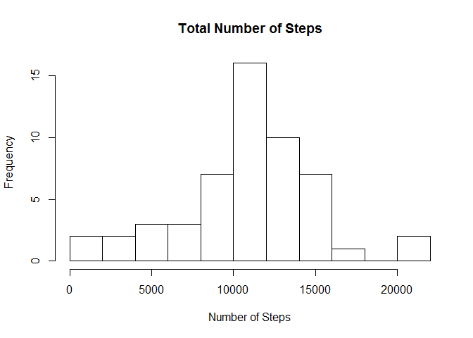
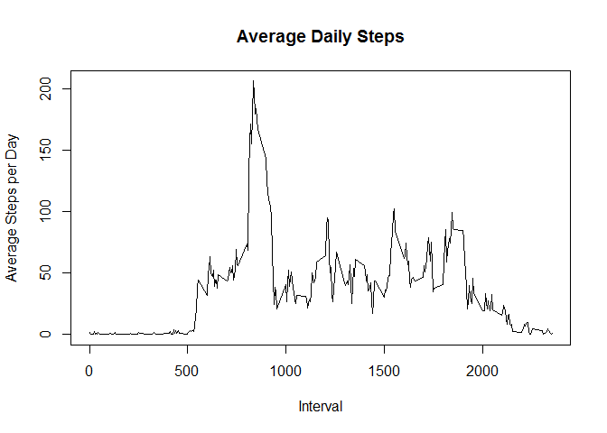
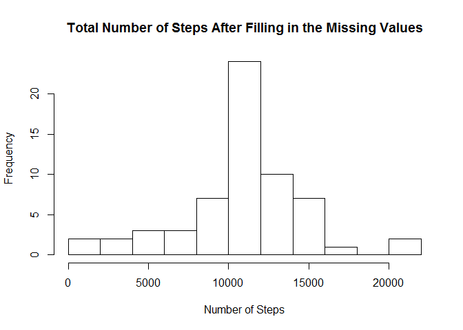
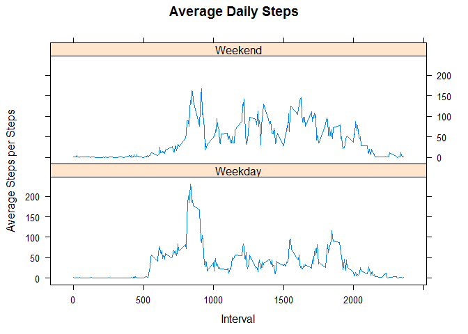

Reproducable Research Course Project 1
=

Loading and preprocessing the data:
=

```r
Activity <- read.csv("./activity.csv")
```

What is mean total number of steps taken per day?
=
First, we're going to make a histogram of the total number of steps taken each day:

```r
t <- with(Activity, tapply(steps, date, sum))
hist(t, breaks = 10, xlab = "Number of Steps", main = "Total Number of Steps")
```

<!-- -->

Now we can calculate the mean and median of the total number of steps taken per day:

```r
Mean <- mean(t, na.rm = T)
Mean
```

```
## [1] 10766.19
```

```r
Med <- median(t, na.rm = T)
Med
```

```
## [1] 10765
```

What is the average daily activity pattern?
=
Let's make a time series plot of the 5-minute intervals and the average number of steps taken, averaged across all days:

```r
SI <- aggregate(steps ~ interval, Activity, mean)

plot(SI$interval, SI$steps, type = "l", xlab = "Interval", ylab = "Average Steps per Day", main = "Average Daily Steps")
```

<!-- -->

Which 5-minute interval, on average across all the days in the dataset, contains the maximum number of steps?

```r
MaxSteps <- SI[which.max(SI$steps), ]
MaxSteps
```

```
##     interval    steps
## 104      835 206.1698
```
Maximum number of steps (206) happens in "835" interval.

Imputing missing values
=
Let's calculate the total number of missing values:

```r
TotalNas <- sum(is.na(Activity$steps))
```
There are 2304 missing values in the dataset.

Now we're going to replace the missing values with the mean for the 5-minute interval associated with each missing value:

```r
Activity2 <- Activity
nas <- is.na(Activity2$steps)
AvgSteps <- with(Activity2, tapply(steps, interval, mean, na.rm=TRUE))
Activity2$steps[nas] <- AvgSteps[as.character(Activity2$interval[nas])]
head(Activity2)
```

```
##       steps       date interval
## 1 1.7169811 2012-10-01        0
## 2 0.3396226 2012-10-01        5
## 3 0.1320755 2012-10-01       10
## 4 0.1509434 2012-10-01       15
## 5 0.0754717 2012-10-01       20
## 6 2.0943396 2012-10-01       25
```

We can make a histogram of the total number of steps taken each day using the new dataset:

```r
t2 <- with(Activity2, tapply(steps, date, sum))
hist(t2, breaks = 10, xlab = "Number of Steps", main = "Total Number of Steps After Filling in the Missing Values")
```

<!-- -->

Now we can calculate the mean and median of the total number of steps taken per day for the new dataset:

```r
Mean2 <- mean(t2, na.rm = T)
Mean2
```

```
## [1] 10766.19
```

```r
Med2 <- median(t2, na.rm = T)
Med2
```

```
## [1] 10766.19
```
As we can see, the mean and median of the dataset have not changed after filling in the missing values; however by comparing the histograms, the total number of steps per day are increased since by replacing the missing values by the mean, we've added steps to the total number of steps.

Are there differences in activity patterns between weekdays and weekends?
=

First, we have to add a column to the dataset to specify if a day is weekday or weekend:

```r
Activity2$DayType <- as.factor(ifelse(weekdays(as.Date(Activity2$date)) == "Saturday" | weekdays(as.Date(Activity2$date)) == "Sunday", "Weekend", "Weekday"))
head(Activity2)
```

```
##       steps       date interval DayType
## 1 1.7169811 2012-10-01        0 Weekday
## 2 0.3396226 2012-10-01        5 Weekday
## 3 0.1320755 2012-10-01       10 Weekday
## 4 0.1509434 2012-10-01       15 Weekday
## 5 0.0754717 2012-10-01       20 Weekday
## 6 2.0943396 2012-10-01       25 Weekday
```

Now we can make two time series plots of the 5-minute interval and the average number of steps taken, averaged across all weekday days or weekend days:

```r
library(lattice)
SI2 <- aggregate(steps ~ interval + DayType, Activity2, mean)
xyplot(SI2$steps ~ SI2$interval|SI2$DayType, main = "Average Daily Steps", xlab = "Interval", ylab = "Average Steps per Steps", layout = c(1, 2), type = "l")
```

<!-- -->
